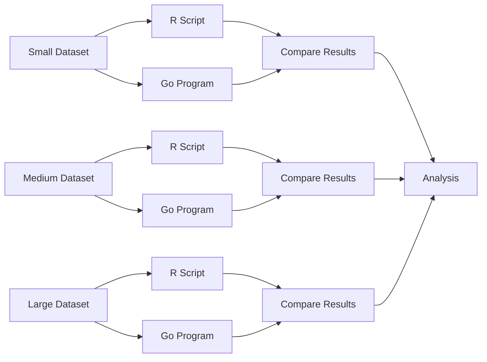

# Detailed Comparison Plan: R Script vs Go Implementation for Influenza A Serotyping

## 1. Algorithm Comparison

### 1.1 Data Structures and Input Processing

| Feature | R Script | Go Program |
|---------|----------|------------|
| **Input Files** | PAF file, Flu info database | PAF file, Mapping file |
| **Data Loading** | Uses `fread` from data.table package | Custom reader with chunking |
| **Memory Management** | Loads entire files into memory | Processes data in chunks |
| **Parallelism** | Sequential processing | Parallel processing with goroutines |

### 1.2 Core Algorithm Differences

```mermaid
flowchart TD
    subgraph "R Script"
    R1[Read PAF file] --> R2[Read flu info database]
    R2 --> R3[Merge data]
    R3 --> R4[Group by qname, tname, serotype, segment, strand]
    R4 --> R5[Calculate ANI, AF, align_score]
    R5 --> R6[Assign reads based on top scores]
    R6 --> R7[Filter by score threshold]
    R7 --> R8[Generate outputs]
    end

    subgraph "Go Program"
    G1[Read mapping file] --> G2[Read PAF file in chunks]
    G2 --> G3[Process chunks in parallel]
    G3 --> G4[Group by QName]
    G4 --> G5[Calculate alignment scores]
    G5 --> G6[Assign reads]
    G6 --> G7[Generate results]
    G7 --> G8[Performance metrics]
    end
```

### 1.3 Key Calculation Differences

| Calculation | R Script | Go Program |
|-------------|----------|------------|
| **ANI** | `tot_match / tot_align` | `NumMatches / AlignLength` |
| **AF** | `tot_align / tot_read_length` | `AlignLength / ReadLength` |
| **Alignment Score** | `ANI * AF` | Appears to use just `ANI` in some places |
| **Read Assignment** | If max(top_score - 0.003) >= min(top_score) OR n_distinct(serotype) == 1, assign first serotype; else "ambiguous" | If all serotypes are the same, assign that serotype; else "ambiguous" |

## 2. Performance Comparison

### 2.1 Execution Time Analysis

```mermaid
gantt
    title Expected Performance Comparison
    dateFormat X
    axisFormat %s
    
    section R Script
    Data Loading      :r1, 0, 10
    Processing        :r2, after r1, 30
    Output Generation :r3, after r2, 10
    
    section Go Program
    Data Loading      :g1, 0, 5
    Chunk Processing  :g2, after g1, 15
    Result Generation :g3, after g2, 5
```

### 2.2 Memory Usage Comparison

| Aspect | R Script | Go Program |
|--------|----------|------------|
| **Memory Model** | Loads entire dataset | Chunk-based processing |
| **Scalability** | May struggle with very large files | Better for large files due to chunking |
| **Peak Memory** | Higher (full dataset in memory) | Lower (only chunks in memory) |

### 2.3 Parallelism and Concurrency

| Feature | R Script | Go Program |
|---------|----------|------------|
| **Parallelism** | Limited (sequential) | High (goroutines) |
| **Worker Control** | N/A | Configurable number of workers |
| **Chunk Size** | N/A | Configurable chunk size |

## 3. Output Comparison

### 3.1 File Outputs

| Output | R Script | Go Program |
|--------|----------|------------|
| **Summary File** | `{sample}_read_summary.tsv` | `{sample}_read_summary.tsv` |
| **Assignment Files** | One file per assignment | One file per assignment |
| **Visualization** | PDF plot | None |
| **Performance** | None | Performance summary and metrics |

### 3.2 Result Accuracy

To compare result accuracy, we need to:

1. Run both implementations on the same dataset
2. Compare the read assignments
3. Analyze any differences in:
   - Number of reads assigned to each serotype
   - Number of ambiguous reads
   - Specific read assignments that differ

## 4. Implementation Plan

### 4.1 Setup Test Environment

1. Select test datasets of varying sizes
2. Prepare execution environment for both implementations
3. Set up metrics collection for:
   - Execution time
   - Memory usage
   - CPU utilization

### 4.2 Execute Tests

### 4.3 Result Analysis

1. Compare execution metrics
2. Compare output files
3. Analyze differences in read assignments
4. Identify potential improvements for both implementations

## 5. Documentation and Recommendations

### 5.1 Comprehensive Report

1. Algorithm comparison
2. Performance analysis
3. Output comparison
4. Identified differences and their causes

### 5.2 Recommendations

1. Potential improvements for each implementation
2. Suggested use cases for each implementation
3. Future development directions