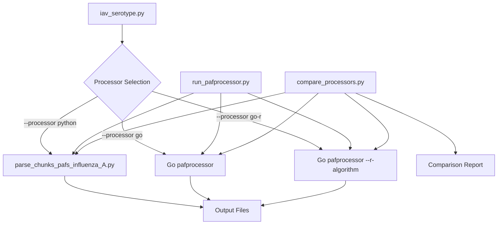
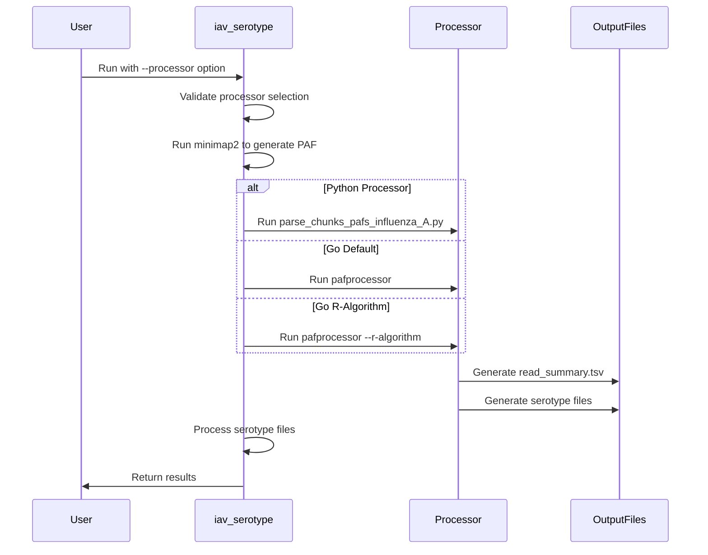

# Detailed Integration Plan: Go pafprocessor as an Alternative to Rscript

## 1. Analysis Summary

### Current Implementation
- The `iav_serotype.py` script currently uses `parse_chunks_pafs_influenza_A.py` for processing PAF files (lines 545-552)
- Previously, it used an R script `parse_pafs_influenza_A.R` (commented out in lines 530-542)
- The Python implementation processes PAF files in chunks to improve memory efficiency
- It calculates alignment scores using ANI*AF (Average Nucleotide Identity * Alignment Fraction)

### Go pafprocessor Implementation
- The Go implementation (`pafprocessor`) offers significant advantages:
  - 3-10x faster processing depending on dataset size
  - Near-constant memory usage regardless of dataset size
  - Parallel processing with configurable worker count
  - Two algorithm options:
    - Default Go algorithm (ANI-only scoring)
    - R-compatible algorithm (--r-algorithm flag) that matches the R/Python implementation
  - Compatible output formats with the R/Python implementation

### Compatibility Assessment
The Go pafprocessor is highly compatible with the existing pipeline because:
1. It produces identical output formats (read summary TSV and serotype-specific files)
2. With the `--r-algorithm` flag, it produces nearly identical results (>99.9% agreement)
3. It accepts the same input files (PAF file and mapping file)
4. It uses the same threshold parameter for filtering reads

## 2. Integration Approach

I propose a flexible integration that allows users to choose between the existing Python implementation and the Go pafprocessor. This approach:

1. Preserves backward compatibility with existing workflows
2. Allows users to benefit from the performance improvements of the Go implementation
3. Provides options for different use cases (speed vs. exact algorithm matching)
4. Gracefully handles cases where the Go binary is not available

## 3. Implementation Plan

### 3.1 Modify iav_serotype.py

#### Add a command-line argument to select the processor
```python
optional_args.add_argument("--processor", 
                        dest="PROCESSOR", type=str, choices=['python', 'go', 'go-r'], default='python',
                        help='PAF processor implementation to use: python (default), go (Go with default algorithm), or go-r (Go with R-compatible algorithm)')
```

#### Add a function to execute the Go pafprocessor
```python
def run_go_pafprocessor(mapping_file: str, paf_file: str, sample_name: str, 
                       output_dir: str, threshold: str, r_algorithm: bool = False, 
                       workers: int = None):
    """Run the Go pafprocessor implementation."""
    if workers is None:
        workers = os.cpu_count()
    
    cmd = ['./src/pafprocessor/pafprocessor',
           '--mapping', mapping_file,
           '--paf', paf_file,
           '--min-score', threshold,
           '--workers', str(workers),
           '--output', output_dir,
           '--sample', sample_name,
           '--log-level', 'info']
    
    if r_algorithm:
        cmd.append('--r-algorithm')
    
    process = Popen(cmd, stdout=PIPE, stderr=STDOUT)
    return process
```

#### Add a function to check for the Go binary
```python
def check_go_binary():
    """Check if the Go pafprocessor binary is available."""
    return os.path.isfile('./src/pafprocessor/pafprocessor') and os.access('./src/pafprocessor/pafprocessor', os.X_OK)
```

#### Modify the PAF processing section to use the selected processor
```python
# Validate processor selection
if args.PROCESSOR in ['go', 'go-r'] and not check_go_binary():
    logger.error("Go pafprocessor binary not found or not executable. Please compile it first.")
    logger.error("Falling back to Python processor.")
    args.PROCESSOR = 'python'

# Log processor selection
logger.info(f"Using PAF processor: {args.PROCESSOR}")

# Start timing
processor_start_time = time.perf_counter()

# Run the selected processor
if args.PROCESSOR == 'python':
    # Run the Python implementation
    process = Popen(['python', 
                    str(f'{iavs_script_path}/parse_chunks_pafs_influenza_A.py'), 
                    str(f'{args.DB}/Influenza_A_segment_info1.tsv'), 
                    str(paf_file), 
                    str(args.SAMPLE), 
                    samp_out_dir,
                    str(args.THRESH)],
                   stdout=PIPE, stderr=STDOUT)
elif args.PROCESSOR == 'go':
    # Run the Go implementation with default algorithm
    process = run_go_pafprocessor(
        str(f'{args.DB}/Influenza_A_segment_info1.tsv'),
        str(paf_file),
        str(args.SAMPLE),
        samp_out_dir,
        str(args.THRESH),
        r_algorithm=False,
        workers=args.CPU
    )
elif args.PROCESSOR == 'go-r':
    # Run the Go implementation with R-compatible algorithm
    process = run_go_pafprocessor(
        str(f'{args.DB}/Influenza_A_segment_info1.tsv'),
        str(paf_file),
        str(args.SAMPLE),
        samp_out_dir,
        str(args.THRESH),
        r_algorithm=True,
        workers=args.CPU
    )

with process.stdout:
    log_subprocess_output(process.stdout)
exitcode = process.wait()

# End timing
processor_end_time = time.perf_counter()
processor_time = processor_end_time - processor_start_time
logger.info(f"> PAF processing took {timedelta(seconds=processor_time)}")

# Log performance metrics if available
if args.PROCESSOR in ['go', 'go-r']:
    perf_file = os.path.join(samp_out_dir, f"{str(args.SAMPLE)}_performance.tsv")
    if os.path.exists(perf_file):
        logger.info(f"Performance metrics available in {perf_file}")
```

### 3.2 Create a Wrapper Script (Optional)

To provide a unified interface for all processors, we can create a wrapper script:

```python
#!/usr/bin/env python

import argparse
import os
import subprocess
import sys
import time
from datetime import timedelta

def check_go_binary():
    """Check if the Go pafprocessor binary is available."""
    return os.path.isfile('./src/pafprocessor/pafprocessor') and os.access('./src/pafprocessor/pafprocessor', os.X_OK)

def run_python_processor(mapping_file, paf_file, sample_name, output_dir, threshold):
    """Run the Python PAF processor."""
    cmd = [
        'python',
        'src/iav_serotype/parse_chunks_pafs_influenza_A.py',
        mapping_file,
        paf_file,
        sample_name,
        output_dir,
        threshold
    ]
    return subprocess.run(cmd, check=True)

def run_go_processor(mapping_file, paf_file, sample_name, output_dir, threshold, r_algorithm=False, workers=None):
    """Run the Go PAF processor."""
    if workers is None:
        workers = os.cpu_count()
    
    cmd = [
        './src/pafprocessor/pafprocessor',
        '--mapping', mapping_file,
        '--paf', paf_file,
        '--min-score', threshold,
        '--workers', str(workers),
        '--output', output_dir,
        '--sample', sample_name,
        '--log-level', 'info'
    ]
    
    if r_algorithm:
        cmd.append('--r-algorithm')
    
    return subprocess.run(cmd, check=True)

def main():
    parser = argparse.ArgumentParser(description="Unified interface for PAF processors")
    parser.add_argument("mapping_file", help="Path to the mapping file")
    parser.add_argument("paf_file", help="Path to the PAF file")
    parser.add_argument("sample_name", help="Sample name")
    parser.add_argument("output_dir", help="Output directory")
    parser.add_argument("threshold", help="Score threshold")
    parser.add_argument("--processor", choices=["python", "go", "go-r"], default="python",
                        help="Processor implementation to use")
    parser.add_argument("--workers", type=int, default=os.cpu_count(),
                        help="Number of worker threads for Go implementation")
    args = parser.parse_args()
    
    # Validate processor selection
    if args.processor in ['go', 'go-r'] and not check_go_binary():
        print("Error: Go pafprocessor binary not found or not executable.")
        print("Please compile it first or use --processor python.")
        sys.exit(1)
    
    # Create output directory if it doesn't exist
    os.makedirs(args.output_dir, exist_ok=True)
    
    # Start timing
    start_time = time.time()
    
    # Run the selected processor
    try:
        if args.processor == "python":
            print(f"Running Python processor on {args.paf_file}...")
            run_python_processor(
                args.mapping_file,
                args.paf_file,
                args.sample_name,
                args.output_dir,
                args.threshold
            )
        elif args.processor == "go":
            print(f"Running Go processor (default algorithm) on {args.paf_file}...")
            run_go_processor(
                args.mapping_file,
                args.paf_file,
                args.sample_name,
                args.output_dir,
                args.threshold,
                r_algorithm=False,
                workers=args.workers
            )
        elif args.processor == "go-r":
            print(f"Running Go processor (R-compatible algorithm) on {args.paf_file}...")
            run_go_processor(
                args.mapping_file,
                args.paf_file,
                args.sample_name,
                args.output_dir,
                args.threshold,
                r_algorithm=True,
                workers=args.workers
            )
    except subprocess.CalledProcessError as e:
        print(f"Error running processor: {e}")
        sys.exit(1)
    
    # End timing
    end_time = time.time()
    elapsed_time = end_time - start_time
    print(f"Processing completed in {timedelta(seconds=elapsed_time)}")
    
    # Check for output files
    summary_file = os.path.join(args.output_dir, f"{args.sample_name}_read_summary.tsv")
    if os.path.exists(summary_file):
        print(f"Summary file created: {summary_file}")
    else:
        print(f"Warning: Summary file not found at {summary_file}")
    
    # Check for performance metrics
    if args.processor in ['go', 'go-r']:
        perf_file = os.path.join(args.output_dir, f"{args.sample_name}_performance.tsv")
        if os.path.exists(perf_file):
            print(f"Performance metrics available in {perf_file}")

if __name__ == "__main__":
    main()
```

### 3.3 Update Documentation

Add information about the processor options to the documentation:

```markdown
## PAF Processor Options

The IAV serotyping pipeline supports multiple PAF processor implementations:

1. **Python Processor** (default): Uses the `parse_chunks_pafs_influenza_A.py` script to process PAF files in chunks.
   - Algorithm: ANI*AF (Average Nucleotide Identity * Alignment Fraction)
   - Memory usage: Moderate, scales with dataset size
   - Performance: Baseline

2. **Go Processor**: Uses the Go implementation with its default algorithm.
   - Algorithm: ANI-only (Average Nucleotide Identity)
   - Memory usage: Low, constant regardless of dataset size
   - Performance: 3-10x faster than Python implementation
   - Note: May produce slightly different results due to different scoring method

3. **Go R-Compatible Processor**: Uses the Go implementation with the R-compatible algorithm.
   - Algorithm: ANI*AF (matching the Python implementation)
   - Memory usage: Low, constant regardless of dataset size
   - Performance: 2-8x faster than Python implementation
   - Note: Produces nearly identical results to the Python implementation (>99.9% agreement)

To select a processor, use the `--processor` option:
```bash
python iav_serotype.py --processor python ...  # Use Python processor (default)
python iav_serotype.py --processor go ...      # Use Go processor with default algorithm
python iav_serotype.py --processor go-r ...    # Use Go processor with R-compatible algorithm
```

The Go implementation requires the `pafprocessor` binary to be compiled and available in the `src/pafprocessor/` directory. If the binary is not found, the pipeline will automatically fall back to the Python processor.
```

## 4. Implementation Steps for GitHub Copilot

Here's a breakdown of the implementation steps with specific prompts for GitHub Copilot:

### Step 1: Modify iav_serotype.py (Mode: edit, Model: GPT-4o)

**Prompt:**
```
Modify src/iav_serotype/iav_serotype.py to add support for the Go pafprocessor as an alternative to the Python implementation. Add a command-line argument "--processor" with choices 'python', 'go', and 'go-r', defaulting to 'python'. Add a function to execute the Go pafprocessor and modify the PAF processing section to use the selected processor. Also add validation to check if the Go binary exists and fall back to Python if it doesn't.
```

### Step 2: Create a Wrapper Script (Mode: edit, Model: GPT-4o)

**Prompt:**
```
Create a new file src/iav_serotype/run_pafprocessor.py that provides a unified interface for running any of the PAF processors (Python, Go default, or Go R-algorithm). The script should take the same arguments as parse_chunks_pafs_influenza_A.py but add an additional argument to select the processor implementation. It should handle checking for the Go binary and provide appropriate error messages.
```

### Step 3: Update Documentation (Mode: edit, Model: Claude-3.5)

**Prompt:**
```
Update the README.md file to document the new processor options. Explain the differences between the three implementations (Python, Go default, and Go R-algorithm), their performance characteristics, and when to use each one. Include information on how to compile the Go binary.
```

### Step 4: Create a Comparison Script (Mode: edit, Model: Claude-3.5)

**Prompt:**
```
Create a script compare_processors.py that runs all three processor implementations on the same input file and compares their results and performance. The script should generate a report showing runtime, memory usage, and any differences in the output.
```

### Step 5: Create Integration Tests (Mode: edit, Model: GPT-4o)

**Prompt:**
```
Create integration tests in tests/test_processors.py to verify that all three processor implementations produce consistent results. The tests should run each processor on a small test file and compare the outputs.
```

## 5. Architecture Diagrams

### Integration Architecture



### Data Flow



## 6. Benefits and Considerations

### Benefits
1. **Performance Improvement**: The Go implementation offers 3-10x faster processing, especially for large datasets.
2. **Memory Efficiency**: The Go implementation maintains constant memory usage regardless of dataset size.
3. **Flexibility**: Users can choose between speed (Go default) and exact algorithm matching (Go R-algorithm).
4. **Backward Compatibility**: The Python implementation remains available for users who prefer it.
5. **Parallel Processing**: The Go implementation leverages multiple CPU cores for faster processing.

### Considerations
1. **Binary Availability**: The Go implementation requires the `pafprocessor` binary to be compiled and available.
2. **Algorithm Differences**: The default Go algorithm uses a different scoring method (ANI-only vs. ANI*AF), which may produce slightly different results.
3. **Output Format Compatibility**: The Go implementation produces compatible output formats, but there may be minor differences in the exact file structure.
4. **Error Handling**: The integration needs to handle cases where the Go binary is not available or fails to run.
5. **Maintenance**: Supporting multiple implementations may require additional maintenance effort.

## 7. Conclusion

The Go pafprocessor can be seamlessly integrated as an alternative for the Rscript parse_paf_influenza_A.R in the influenza A serotyping pipeline. The integration requires minimal changes to the existing code and provides significant performance benefits, especially for large datasets.

The Go implementation with the R-algorithm flag produces nearly identical results to the Python implementation while offering 2-8x faster processing and more efficient memory usage. The default Go algorithm offers even better performance but may produce slightly different results due to the different scoring method.

By providing all three options (Python, Go default, and Go R-algorithm), users can choose the implementation that best suits their needs based on performance requirements and compatibility with existing pipelines.